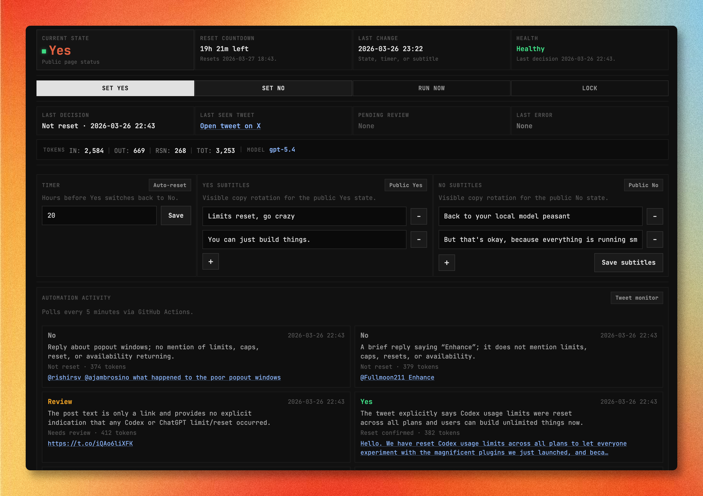

# Codex Limit

`Codex Limit` is a small status site for tracking whether Codex rate limits have reset.

It has two surfaces:

- A public `/` page that shows a simple `Yes` or `No`
- A private `/config` page for state control, timer management, subtitle editing, and tweet-monitor review

## Screenshot

Admin config UI:



## What It Does

- Serves a public reset-status page
- Persists shared state in `data/site-state.json`
- Protects admin actions with cookie-based auth
- Supports manual state changes and an auto-reset timer
- Polls recent `@thsottiaux` tweets and classifies whether they indicate a reset
- Sends uncertain tweets to manual review instead of flipping the public page automatically
- Exposes a compact public automation summary that adapts to active `yes` and inactive `no` states

## Architecture

- Frontend: plain HTML, CSS, and JavaScript
- App server: `server.mjs`
- API routes: `api/`
- Cloudflare Pages adapters: `functions/`
- Shared state store: tracked `data/site-state.json`
- Tweet monitor: `api/_lib/reset-monitor.mjs`

The public state file contains the public fields plus an encrypted private blob for session and automation internals.

## Public Summary UX

The public home page intentionally keeps the hero simple, then shows a compact automation summary underneath.

- When the site is `yes`, the summary pins the reset-confirming tweet, shows the model rationale, and displays live relative age text like `Seen 01:22:51 ago`.
- When the site is `no`, the summary collapses into a smaller three-row trace: latest tweet seen and `No` verdict, latest check cost, and the last `Yes` verdict seen.
- The active `yes` state still auto-reverts to `no` after the configured timer window. The client also watches `resetAt` live so the page can swap layouts as soon as that window expires.

More detail: [docs/public-summary.md](./docs/public-summary.md)

## Routes

- `/` public status page
- `/config` admin config page
- `/api/status` public status payload
- `/api/admin/session` admin login/logout
- `/api/admin/config` authenticated config read/write
- `/api/admin/automation` manual tweet-monitor run
- `/api/automation/poll` cron endpoint for automated polling

## Local Development

Requirements:

- Node `22.x`
- The environment variables listed below

Install and run:

```bash
npm install
npm test
npm start
```

The local server runs from `server.mjs`.

## Environment

Runtime configuration is driven by environment variables:

- `AI_REVIEW_EMAIL`
- `CRON_SECRET`
- `GITHUB_REPO_BRANCH`
- `GITHUB_REPO_NAME`
- `GITHUB_REPO_OWNER`
- `GITHUB_TOKEN`
- `OPENAI_API_KEY`
- `OPENAI_REASONING_MODEL`
- `RESEND_API_KEY`
- `RESEND_FROM_EMAIL`
- `RETTIWT_API_KEY`
- `SITE_ADMIN_PASSWORD`
- `SITE_ANALYTICS_URL` optional
- `SITE_BASE_URL`
- `SITE_PRIVATE_STATE_SECRET`
- `SITE_SESSION_SECRET`
- `HOST`
- `PORT`
- `NODE_ENV`

## Deployment

This repo currently has two deployment paths checked in:

- `Deploy Lightsail`
  Triggered on pushes to `main` except pure `data/site-state.json` updates.
  It runs tests, bundles the app, writes the runtime env file, and deploys the Node server to a Lightsail instance behind `systemd`.

- `Deploy Cloudflare Pages`
  Manual workflow for deploying the static/Pages-compatible surface.

There is also a one-off `Cutover Cloudflare DNS` workflow for DNS changes.

## Notes

- `RETTIWT_API_KEY` is used to fetch recent tweets more reliably than the guest timeline.
- When the state is set to `yes`, the app stores `resetAt` and automatically falls back to `no` after the configured window.
- When the model is uncertain, the monitor creates a manual review item instead of auto-switching the public page.
- The public summary uses the latest confirmed reset when `yes` is active, and a compact latest-check trace when the site has already returned to `no`.

## License

MIT. See [LICENSE](./LICENSE).
